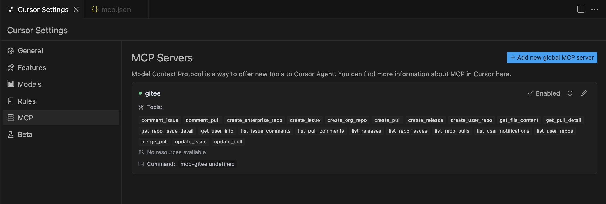

stdio mode
```json
{
  "mcpServers": {
    "gitee": {
      "command": "mcp-gitee",
      "env": {
        "GITEE_API_BASE": "https://gitee.com/api/v5",
        "GITEE_ACCESS_TOKEN": "<your personal access token>"
      }
    }
  }
}
```

sse mode

start mcp server through sse
```bash
mcp-gitee -token <your personal access token> -transport sse
```
```json
{
  "mcpServers": {
    "gitee": {
      "url": "http://localhost:8000/sse",
    }
  }
}
```
