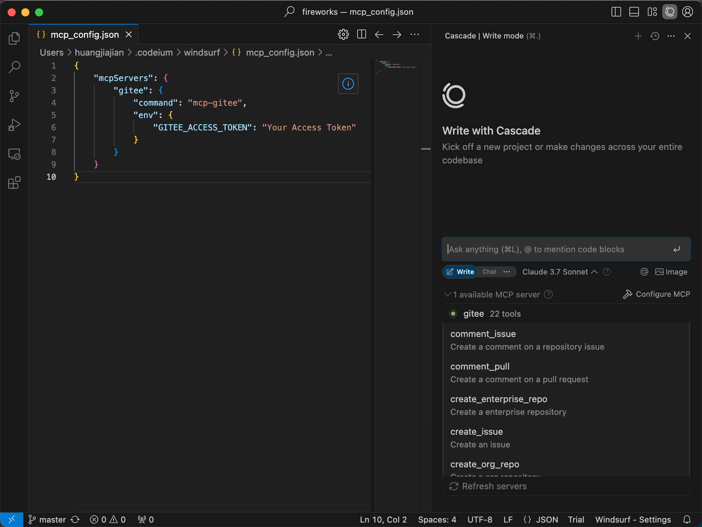

stdio mode:
```json
{
  "mcpServers": {
    "gitee": {
      "command": "mcp-gitee",
      "env": {
        "GITEE_API_BASE": "https://gitee.com/api/v5",
        "GITEE_ACCESS_TOKEN": "<your personal access token>"
      }
    }
  }
}
```

